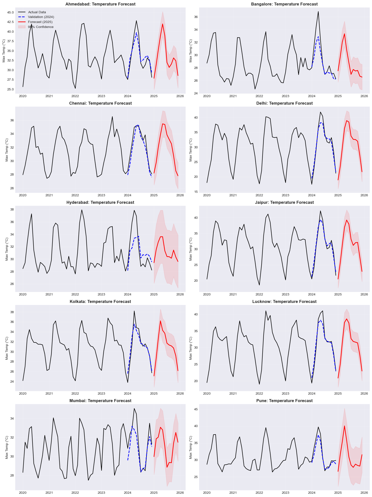
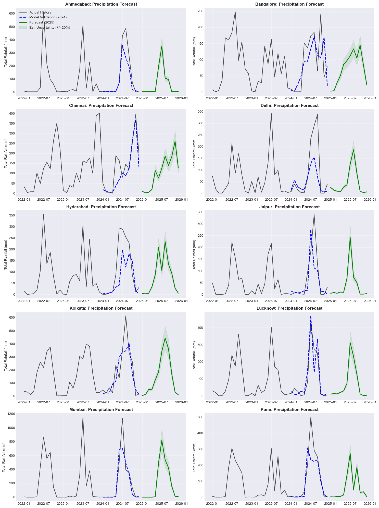
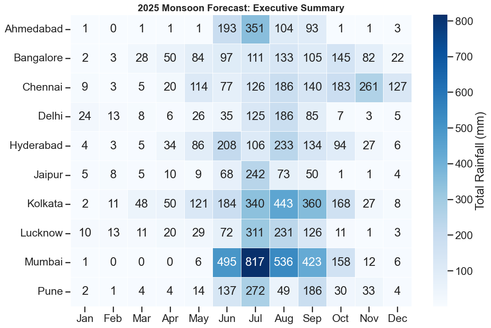

# 🌦️ Dual-Stream Climate Forecasting: India 2025


## 📑 Executive Summary
This project implements an end-to-end machine learning pipeline to forecast **monthly average maximum temperatures** and **total precipitation** for 10 major Indian cities for the year 2025. 

Recognizing that temperature and rainfall follow fundamentally different statistical distributions, we utilized a **Dual-Stream Modeling Strategy**:
* **Temperature:** Modeled using **SARIMA** (Seasonal Auto-Regressive Integrated Moving Average) to capture linear trends and stable seasonality (**Avg RMSE < 1.5°C**).
* **Precipitation:** Modeled using **Histogram-Based Gradient Boosting** with a **Poisson Loss** objective to handle zero-inflated, skewed rainfall data, successfully predicting monsoon onset and withdrawal.

**Key Outcome:** A validated 2025 Forecast Dashboard that differentiates between the distinct monsoon patterns of the West Coast (Mumbai), North India (Delhi), and the Southern Peninsula (Chennai).

---

## 📊 Visual Highlights

### 1. Temperature Forecast (SARIMA)
*The model captures the steady seasonal warming trend across all cities, with clear confidence intervals (red shaded region) indicating prediction certainty.*


### 2. Precipitation Forecast (Gradient Boosting)
*Unlike temperature, rainfall is erratic. The model successfully predicts the distinct "Monsoon Spikes" for coastal cities vs. inland regions.*


### 3. Executive Summary Heatmap
*A high-level view of 2025 rainfall intensity (mm) across all 10 cities.*


---

## 🛠️ Methodology

### Data Pipeline
* **Source:** Daily weather data (2000–2024) for 10 Indian cities (`india_2000_2024_daily_weather.csv`).
* **Preprocessing:** Aggregated daily records to monthly frequency (Mean for Temperature, Sum for Precipitation). Confirmed data completeness (0% missing values, no duplicates).

### Modeling Approach
| Variable | Algorithm | Key Configuration | Rationale |
| :--- | :--- | :--- | :--- |
| **Temperature** | **SARIMA** | **Optimized per city** (e.g., `(1,0,0)x(1,0,1,12)`) | Parameters selected via **AIC minimization** to best fit local climate trends. |
| **Precipitation** | **Gradient Boosting** | `loss='poisson'`, `lags=[1,12,24]` | Poisson loss handles "zero mass" (dry seasons) and skewed rainfall distributions. |

### Validation Strategy
I employed a rigorous **Hybrid Validation Scheme** to ensure statistical robustness:
1. **5-Fold Time Series Cross-Validation:** Tested model stability on the training set (2000–2023) using expanding window validation.
2. **Out-of-Time Holdout (2024):** The year **2024** was strictly withheld during training to simulate "future" performance (e.g., Mumbai Holdout RMSE: 1.15°C).
3. **Final Forecast (2025):** The models were retrained on the full dataset (2000–2024) to generate the final predictions for 2025.

---

## 📂 Project Structure

```bash
├── India_Weather_Forecast_2025.csv   # 📤 FINAL OUTPUT: The 2025 predictions
├── weather_project.ipynb             # 📓 The main Jupyter Notebook (Code)
├── india_2000_2024_daily_weather.csv # 📥 Raw Input Data
├── README.md                         # 📖 Project Documentation
└── requirements.txt                  # 📦 Dependencies
-----------------
