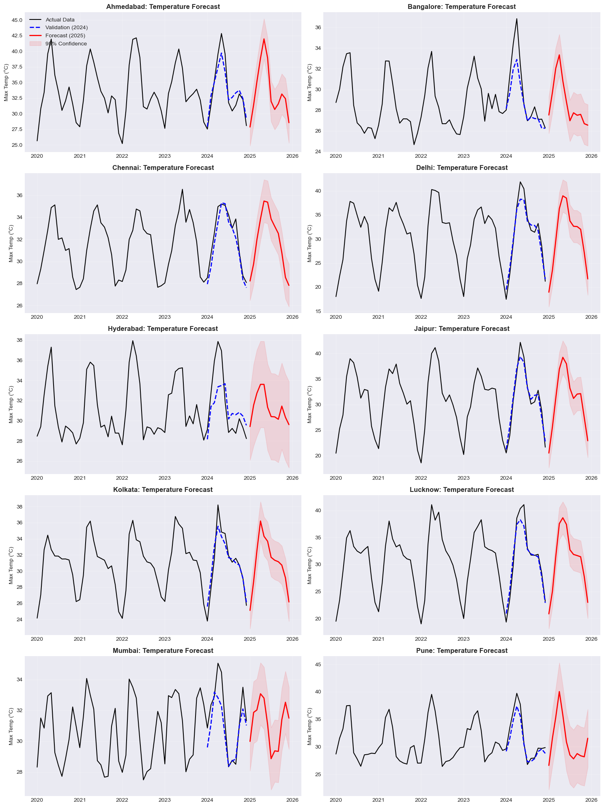
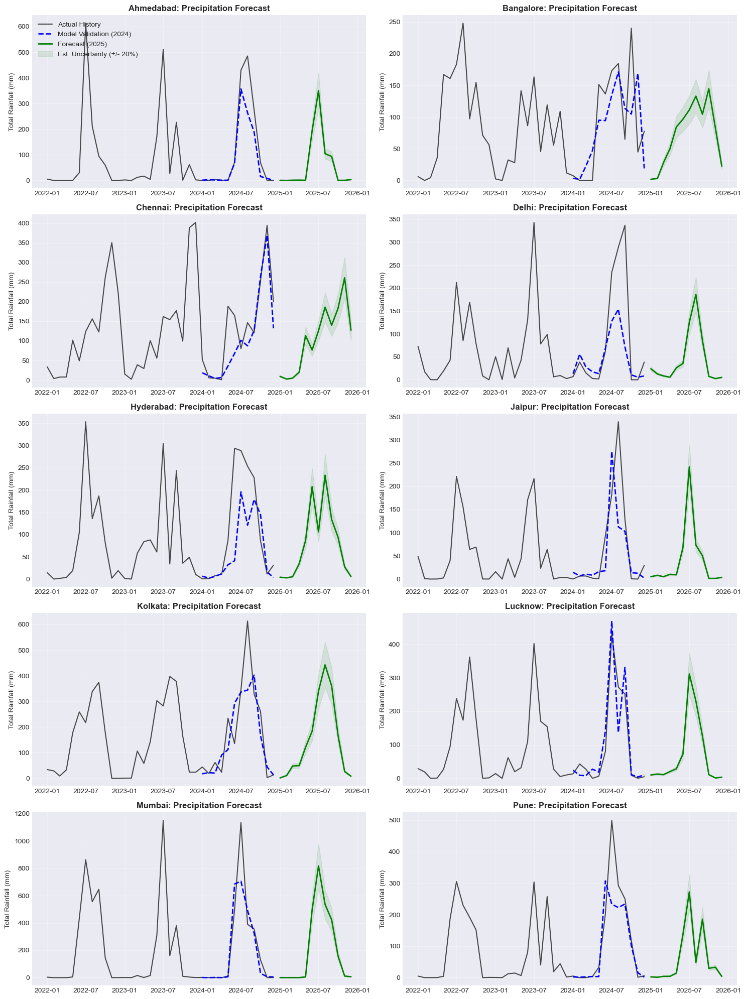
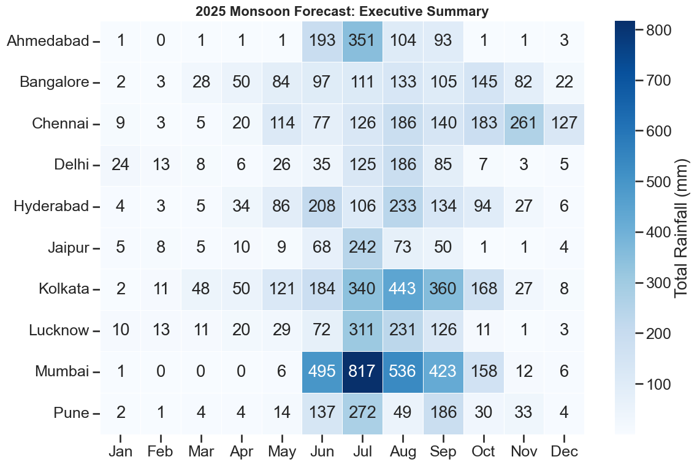

# 🌦️ Dual-Stream Climate Forecasting: India 2025


-purple)


## 📑 Executive Summary
This project implements an end-to-end machine learning pipeline to forecast **monthly average maximum temperatures** and **total precipitation** for 10 major Indian cities for the year 2025. 

Recognizing that temperature and rainfall follow fundamentally different statistical distributions, I utilized a **Dual-Stream Modeling Strategy**:
* **Temperature:** Modeled using **SARIMA** (Seasonal Auto-Regressive Integrated Moving Average) to capture linear trends and stable seasonality (**Avg RMSE < 1.5°C**).
* **Precipitation:** Modeled using **Histogram-Based Gradient Boosting** with a **Poisson Loss** objective to handle zero-inflated, skewed rainfall data, successfully predicting monsoon onset and withdrawal.

**Key Outcome:** A validated 2025 Forecast Dashboard that differentiates between the distinct monsoon patterns of the West Coast (Mumbai), North India (Delhi), and the Southern Peninsula (Chennai). Forecast results are automatically translated into plain-English executive summaries using **LLaMA 3.3 70B via Groq**, making insights accessible to non-technical stakeholders.

---

## 📊 Visual Highlights

### 1. Temperature Forecast (SARIMA)
*The model captures the steady seasonal warming trend across all cities, with clear confidence intervals (red shaded region) indicating prediction certainty.*


### 2. Precipitation Forecast (Gradient Boosting)
*Unlike temperature, rainfall is erratic. The model successfully predicts the distinct "Monsoon Spikes" for coastal cities vs. inland regions.*


### 3. Executive Summary Heatmap
*A high-level view of 2025 rainfall intensity (mm) across all 10 cities.*


---

## 🛠️ Methodology

### Data Pipeline
* **Source:** Daily weather data (2000–2024) for 10 Indian cities (`india_2000_2024_daily_weather.csv`).
* **Preprocessing:** Aggregated daily records to monthly frequency (Mean for Temperature, Sum for Precipitation). Confirmed data completeness (0% missing values, no duplicates).

### Modeling Approach
| Variable | Algorithm | Key Configuration | Rationale |
| :--- | :--- | :--- | :--- |
| **Temperature** | **SARIMA** | **Optimized per city** (e.g., `(1,0,0)x(1,0,1,12)`) | Parameters selected via **AIC minimization** to best fit local climate trends. |
| **Precipitation** | **Gradient Boosting** | `loss='poisson'`, `lags=[1,12,24]` | Poisson loss handles "zero mass" (dry seasons) and skewed rainfall distributions. |
| **Stakeholder Summaries** | **LLaMA 3.3 70B (Groq)** | `groq` API, zero-shot prompting | Translates numerical forecasts into plain-English business summaries for non-technical audiences. |

### Validation Strategy
I employed a rigorous **Hybrid Validation Scheme** to ensure statistical robustness:
1. **5-Fold Time Series Cross-Validation:** Tested model stability on the training set (2000–2023) using expanding window validation.
2. **Out-of-Time Holdout (2024):** The year **2024** was strictly withheld during training to simulate "future" performance (e.g., Mumbai Holdout RMSE: 1.15°C).
3. **Final Forecast (2025):** The models were retrained on the full dataset (2000–2024) to generate the final predictions for 2025.

---

## 📂 Project Structure

```bash
├── India_Weather_Forecast_2025.csv   # 📤 FINAL OUTPUT: The 2025 predictions
├── weather_project.ipynb             # 📓 The main Jupyter Notebook (Code)
├── india_2000_2024_daily_weather.csv # 📥 Raw Input Data
├── README.md                         # 📖 Project Documentation
└── requirements.txt                  # 📦 Dependencies
```


---

## 🤖 LLM Integration

Forecast results are passed to **LLaMA 3.3 70B** (via [Groq](https://console.groq.com)) to generate concise, non-technical executive summaries for each city. Example output for Mumbai:

> *"Mumbai's climate is characterized by high temperatures and significant rainfall, with an average temperature of 30.5°C and average rainfall of 5.7mm over the past 25 years. Compared to the national average, Mumbai's temperature is slightly cooler (0.4°C lower) and its rainfall is significantly higher (2.6mm more). Notably, the city has experienced a warming trend, with temperatures rising by 0.4°C between 2000-2004 and 2020-2024."*

To use this feature, set your Groq API key and run the final cell in the notebook.

---

## ⚠️ Model Limitations

SARIMA residual diagnostic tests indicated autocorrelation ($p < 0.05$) for **Delhi, Mumbai, and Hyderabad**, suggesting the presence of non-linear climatic factors (e.g., urban heat islands, localized weather systems) not fully captured by the model. Forecasts and LLM summaries for these cities should be interpreted with caution. All other cities passed diagnostic checks and are well-validated.
